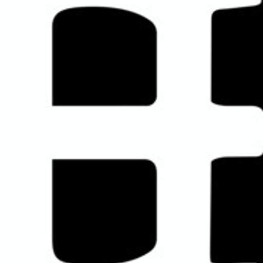
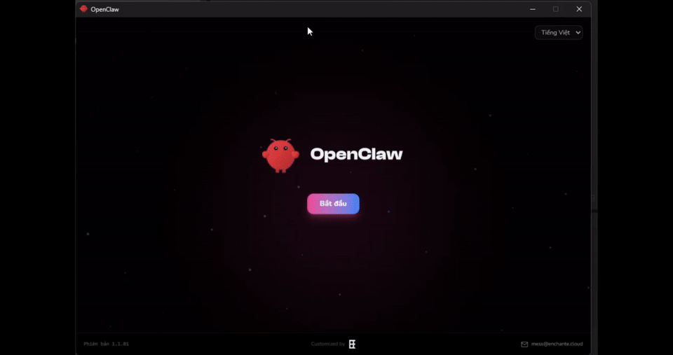

<p align="center">
  
</p>

<h1 align="center">OpenClaw Enchante</h1>

<p align="center">
  <strong>Desktop installer for the <a href="https://github.com/openclaw/openclaw">OpenClaw</a> AI agent — customized by Enchante</strong>
</p>

<p align="center">
  ENGLISH · VIETNAMESE · 中文 · FRANCAIS · 한국어 · 日本語
</p>

<p align="center">
  
  <a href="LICENSE"></a>
</p>

<p align="center">
  <a href="https://enchante.cloud">enchante.cloud</a> · <a href="https://github.com/openclaw/openclaw">OpenClaw upstream</a>
</p>

---

<p align="center">
  <a href="docs/INTRO-OPENCLAW-ENCHANTE.mp4">
    
  </a>
</p>

## What it is

**OpenClaw Enchante** is an Electron app that guides non-technical users through installing and configuring OpenClaw on **macOS** or **Windows** (Windows uses **WSL Ubuntu** for Node + OpenClaw CLI). It handles provider keys, chat channels (Telegram, Zalo, Lark/Feishu), optional NemoClaw Shield, smoke tests, and troubleshooting helpers.

Full technical layout: **[docs/APP-ARCHITECTURE.md](docs/APP-ARCHITECTURE.md)**.

## Features (product scope)

- Wizard: Welcome → environment check → WSL (Windows) → install Node/OpenClaw → API provider & model → **chat platforms** → **config** → **hooks (Nemo shield)** → done + smoke test / logs
- **Pinned OpenClaw CLI** version in `src/main/services/openclaw-release.ts` (adjust when you approve a new release)
- **NSIS**: optional install directory, elevation, custom script to close app / clean old uninstall registry (`build/installer.nsh`)
- **i18n**: `en`, `ko`, `ja`, `zh`, `fr`, `vi` under `src/shared/i18n/locales/`

## Development

```bash
npm install
npm run dev       # electron-vite dev
npm run build     # typecheck + production build
npm run lint
npm run format
```

Packaging (local):

```bash
npm run build:mac-local
npm run build:win-local   # small OPENCLAW-setup.exe + EClaw-*-win.zip; installer downloads zip from manifest URL at run time
```

> **Installer path**: Do not install the packaged app into your **source tree** — the uninstaller can delete that folder. Use a separate directory (e.g. `C:\Program Files\...` or `D:\Apps\...`).

## Repository layout (short)

| Path | Role |
|------|------|
| `src/main/` | Electron main: IPC, services (install, onboard, gateway, WSL, smoke, fixer fix) |
| `src/preload/` | `contextBridge` → `window.electronAPI` |
| `src/renderer/` | React wizard UI |
| `src/shared/` | i18n, shared constants (e.g. `chat-platforms.ts`) |
| `build/` | Icons, NSIS include, installer images |
| `docs/` | Minimal static site (`index.html`, `privacy.html`) + **APP-ARCHITECTURE.md** |
| `api/` | Optional Vercel handlers (newsletter / waitlist); CORS allowlist in each file |

## Contributing

See [CONTRIBUTING.md](CONTRIBUTING.md).

## License

[MIT](LICENSE) — OpenClaw upstream is MIT; this distribution adds Enchante-specific UI and automation.
